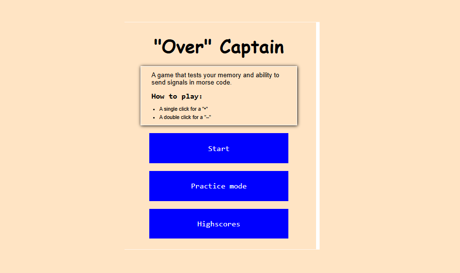

# "Over" Captain
## This is a game inspired by the theme "Signal", where players are given a word and are to input it in Morse code within a specified period of time. 

## How to play the game
### The game works on 2 characters, a click for "•" and a double click for "–"
### You can choose to start game or go to practice mode based on your confidence level

## Technologies used
### JavaScript, HTML, and CSS

## Demo
### 
### 